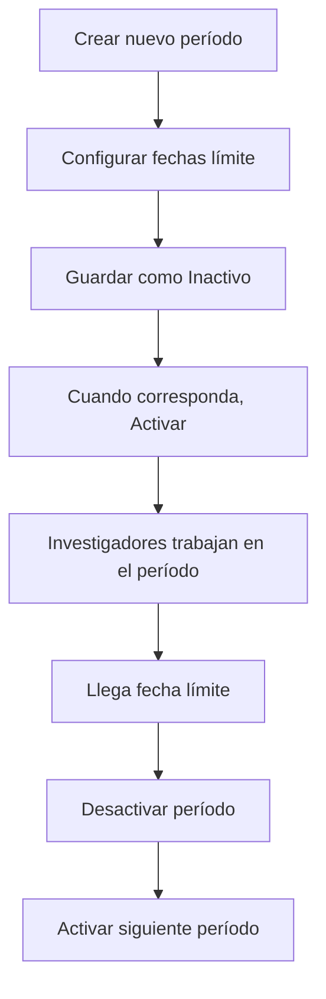

import { Steps } from '@astrojs/starlight/components';
import { Card, CardGrid } from '@astrojs/starlight/components';
import { Aside } from '@astrojs/starlight/components';

<Card title="Objetivo Funcional" icon="setting">
    Los **Períodos Académicos** son las unidades temporales que estructuran el 
    sistema de investigación. Definen los rangos de tiempo en los que se crean 
    planes de trabajo, se entregan productos y se evalúa el cumplimiento de los 
    investigadores. Son la base temporal de todo el sistema.
</Card>

## Acceso y navegación

Para acceder a este módulo, sigue la siguiente ruta:

**Menú Principal → Parámetros → Períodos Académicos**

{/*  */}

<Aside type="note" title="Permisos requeridos">
Este módulo está disponible únicamente para usuarios con rol de **Administrador**.
</Aside>

---

## Concepto de Período Académico

Un período académico representa un **semestre** o **ciclo académico** y define:

- 📅 **Nombre:** Identificación del período (ej: "2024-1", "Enero-Junio 2024")
- 📆 **Fecha límite de planeación:** Hasta cuándo se pueden crear/editar planes de trabajo
- 📆 **Fecha límite de evidencias:** Hasta cuándo se pueden entregar productos
- 🔄 **Estado:** Activo o Inactivo

---

## Listado de Períodos

La vista principal muestra todos los períodos registrados:

| Campo | Descripción |
|-------|-------------|
| **Nombre** | Identificación del período |
| **Fecha Límite Planeación** | Fecha tope para planes de trabajo |
| **Fecha Límite Evidencias** | Fecha tope para entregas de productos |
| **Estado** | Activo / Inactivo |
| **Acciones** | Editar, cambiar estado, eliminar |

{/*  */}

<Aside type="tip" title="Identificación visual">
Los períodos activos se resaltan con un color distintivo (verde) para 
fácil identificación.
</Aside>

---

## Crear un Nuevo Período

<Steps>
1. **Iniciar creación**
    
    Presiona el botón **`+ Nuevo Período`** en la parte superior derecha.

    {/*  */}

2. **Completar información**
    
    Ingresa los datos del período en el formulario:

    - **Nombre:** Identificación única del período (requerido)
      - Ejemplos: "2024-1", "2024-2", "Semestre I 2024"
    
    - **Fecha Límite de Planeación:** Fecha hasta la cual los investigadores 
      pueden crear y editar sus planes de trabajo (requerido)
    
    - **Fecha Límite de Evidencias:** Fecha hasta la cual se pueden entregar 
      productos investigativos (requerido)

    {/*  */}

    <Aside type="note" title="Validación de fechas">
    El sistema valida que:
    - El nombre no esté duplicado
    - La fecha de planeación sea anterior a la de evidencias
    - Las fechas sean futuras (para períodos nuevos)
    </Aside>

3. **Definir estado inicial**
    
    Selecciona el estado del período:
    - **Activo:** Los investigadores pueden trabajar en este período
    - **Inactivo:** El período existe pero no está disponible para uso

    <Aside type="caution" title="Solo un período activo">
    El sistema permite tener **solo un período activo a la vez**. Si activas 
    un período nuevo, el anterior se desactivará automáticamente.
    </Aside>

4. **Guardar período**
    
    Presiona **`Guardar`** para crear el período.
    
    El sistema mostrará un mensaje de confirmación y el período aparecerá 
    en el listado.

</Steps>

---

## Editar un Período Existente

<Steps>
1. **Seleccionar período**
    
    En la tabla, localiza el período que deseas modificar y presiona el 
    botón de **edición** (ícono de lápiz).

2. **Modificar datos**
    
    Actualiza los campos necesarios:
    - Nombre del período
    - Fecha límite de planeación
    - Fecha límite de evidencias

    <Aside type="caution" title="Restricción en períodos activos">
    No puedes **reducir** las fechas límite de un período activo si ya 
    existen planes de trabajo o entregas registradas. Solo puedes extenderlas.
    </Aside>

3. **Guardar cambios**
    
    Presiona **`Actualizar`** para confirmar las modificaciones.

</Steps>

---

## Gestionar Estado de Períodos

### Activar un Período

<Steps>
1. Localiza el período inactivo en la tabla
2. Presiona el interruptor en la columna **Estado**
3. Confirma la activación en el diálogo emergente

    <Aside type="danger" title="Desactivación automática">
    Al activar este período, cualquier otro período activo se desactivará 
    automáticamente. Esta acción es irreversible.
    </Aside>

4. El período cambiará a estado **Activo** y los investigadores podrán 
   comenzar a trabajar en él
</Steps>

### Desactivar un Período

<Steps>
1. Localiza el período activo en la tabla
2. Presiona el interruptor en la columna **Estado**
3. Confirma la desactivación
    <Aside type="caution" title="Impacto de desactivación">
    Al desactivar un período:
    - Los investigadores no podrán crear nuevos planes de trabajo
    - No se podrán entregar nuevos productos
    - Los datos existentes permanecen intactos pero en modo solo lectura
    </Aside>
</Steps>

---

## Eliminar un Período

<Steps>
1. Localiza el período en la tabla
2. Presiona el botón de **eliminación** (ícono de basura)
3. Lee la advertencia en el diálogo de confirmación
4. Confirma la eliminación

    <Aside type="danger" title="Eliminación restringida">
    No puedes eliminar un período si tiene:
    - ✗ Planes de trabajo asociados
    - ✗ Entregas de productos registradas
    - ✗ Horas de investigación asignadas
    - ✗ Estado activo

    Solo se pueden eliminar períodos sin datos vinculados.
    </Aside>
</Steps>

---

## Flujo típico de uso

### Ciclo semestral típico

<Steps>
1. **2 semanas antes del semestre:** Crear el nuevo período en estado Inactivo
2. **Inicio del semestre:** Activar el período
3. **Primeras 4 semanas:** Los investigadores crean sus planes de trabajo
4. **Durante el semestre:** Los investigadores desarrollan sus productos
5. **Últimas 2 semanas:** Los investigadores entregan evidencias
6. **Fin del semestre:** Desactivar el período
7. **Inicio del siguiente:** Activar el nuevo período
</Steps>

---

## Reglas de negocio

<CardGrid>
  <Card title="Nombre único" icon="warning">
    No pueden existir dos períodos con el mismo nombre.
  </Card>
  <Card title="Un solo período activo" icon="warning">
    Solo puede haber un período activo simultáneamente en el sistema.
  </Card>
  <Card title="Fechas coherentes" icon="warning">
    La fecha de planeación debe ser anterior a la fecha de evidencias.
  </Card>
  <Card title="Eliminación condicional" icon="information">
    Solo se pueden eliminar períodos sin datos vinculados.
  </Card>
</CardGrid>

---

## Impacto en otros módulos

La configuración de períodos afecta directamente a:

| Módulo | Impacto |
|--------|---------|
| **Horas de Investigación** | Define en qué período se asignan las horas |
| **Plan de Trabajo** | Determina la vigencia de los planes |
| **Entregas de Productos** | Establece las fechas límite de planeación y evidencias |
| **Reportes** | Los análisis se generan por período académico |

---

## Errores comunes y soluciones

| Error | Causa | Solución |
|-------|-------|----------|
| "Nombre duplicado" | Ya existe un período con ese nombre | Usa un nombre diferente |
| "Fecha inválida" | Fecha de planeación posterior a evidencias | Ajusta las fechas correctamente |
| "Ya existe período activo" | Hay otro período activo | Desactiva el período actual primero |
| "No se puede eliminar" | El período tiene datos asociados | No se puede eliminar, solo desactivar |
| "Fecha pasada" | Intentas crear un período con fechas antiguas | Verifica las fechas ingresadas |

---

## Preguntas frecuentes

<Aside type="tip" title="¿Puedo tener varios períodos activos?">
No, el sistema solo permite un período activo a la vez para mantener la 
coherencia de los datos y evitar confusiones.
</Aside>

<Aside type="tip" title="¿Qué pasa con los datos de períodos desactivados?">
Los datos permanecen intactos y accesibles en modo solo lectura. Puedes 
consultar planes de trabajo y entregas de períodos anteriores sin problema.
</Aside>

<Aside type="tip" title="¿Puedo reactivar un período antiguo?">
Sí, puedes reactivar períodos desactivados si necesitas hacer ajustes o 
correcciones. Sin embargo, esto desactivará el período actual.
</Aside>

<Aside type="tip" title="¿Con cuánta anticipación debo crear un período?">
Se recomienda crear el período al menos 2 semanas antes de su inicio, 
manteniéndolo inactivo hasta la fecha correspondiente.
</Aside>